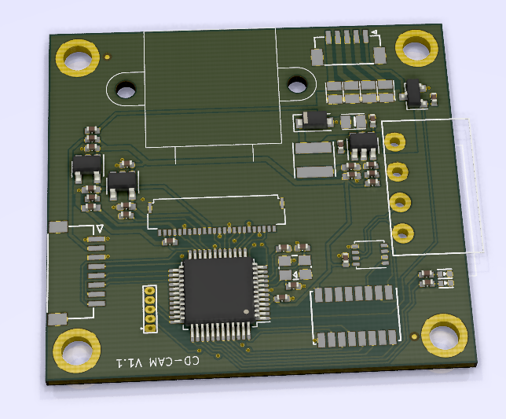

CDCAM Introduction
=======================================



Download this project:
```
git clone --recurse-submodules https://github.com/dukelec/cdcam.git
```

## GUI Tool

CDBUS GUI Tool: https://github.com/dukelec/cdbus_gui

In the current configuration, the frame rate of 800x600 pictures is tested at 10 fps. (Restricted by the performance of the STM32G0 chip.)

Default sensor: OV2640.


Notes:  
After modifying the configuration, write 1 to `save_conf` to save the configuration to flash.  
If you need to restore the default configuration, change `magic_code` to another value and save it to flash. Then reapply power.


## Hardware

Schematic: <a href="hardware/cdcam_sch.pdf">cdcam_sch.pdf</a>

