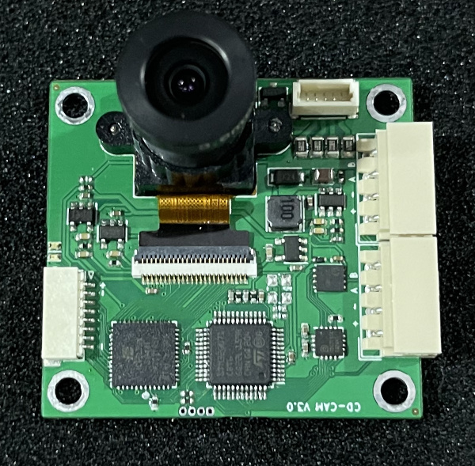
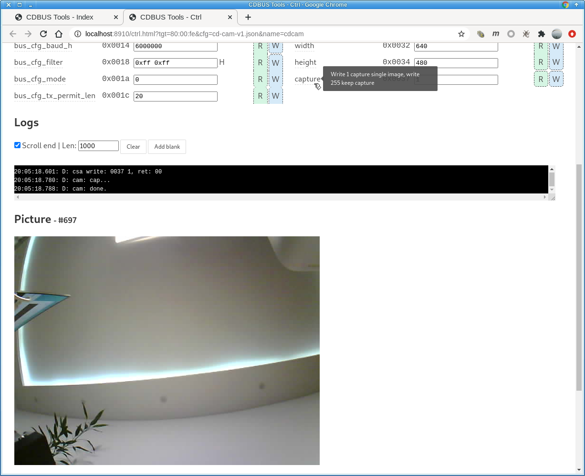

CDCAM Introduction
=======================================



RS-485 wire housing: Molex 5264 (4 pin)

Download this project:
```
git clone --recurse-submodules https://github.com/dukelec/cdcam.git
```

## GUI Tool

CDBUS GUI Tool: https://github.com/dukelec/cdbus_gui

In the current configuration, the frame rate of 800x600 pictures is tested at 5 fps.  

The frame rate can be higher, ultimately limited by the richness of the captured image (which affects the JPG image size),
the bandwidth of the bus, and the performance of the HTML5 GUI tool (HTML5 will get stuck with too much data).

Default sensor: OV2640.



Notes:  
After modifying the configuration, write 1 to `save_conf` to save the configuration to flash.  
If you need to restore the default configuration, change `magic_code` to another value and save it to flash. Then reapply power.


## Hardware

Schematic: <a href="hardware/cdcam_sch_v2.0.pdf">cdcam_sch_v2.0.pdf</a>

Hardware without FPGA please switch to branch: `hw_v1`

